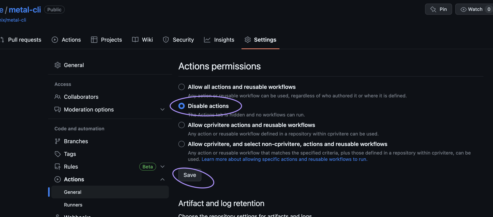

<!-- See https://squidfunk.github.io/mkdocs-material/reference/ -->
# Part 2: Setup a Github Self-hosted runner

## Steps

### 1. Fork metal-cli to your own github

For this workshop, we'll be making a copy of the Equinix Metal CLI code repository to create and test our runners. You could use your own code repository if you already have one. If you do, you can skip this step.

Click on this link "[Fork Metal CLI](https://github.com/equinix/metal-cli/fork)" and fork a copy to your own Github account.

### 2. Disable the actions on your fork of metal-cli

Go to your fork of metal-cli and click on 'Settings' -> 'Actions' -> 'Runners' and disable the actions for now.


### 3. Deploy a new machine on Equinix Metal

```sh
metal device create -p $METAL_PROJECT_ID -P c3.medium.x86 -m da -H github-runner-test -O ubuntu_22_04
```

## Discussion

Before proceeding to the next part let's take a few minutes to discuss what we did. Here are some questions to start the discussion.

- What sorts of code repositories would you want to run your own runners on?
- What size machine would be right for your runners?
