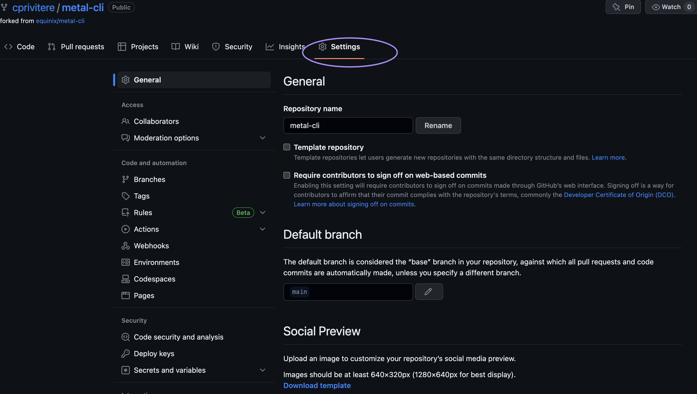
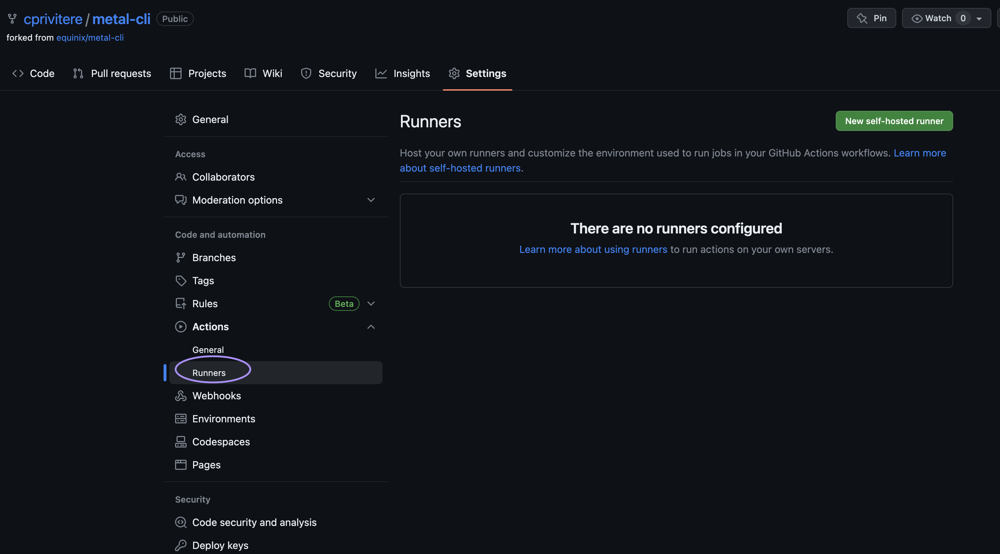
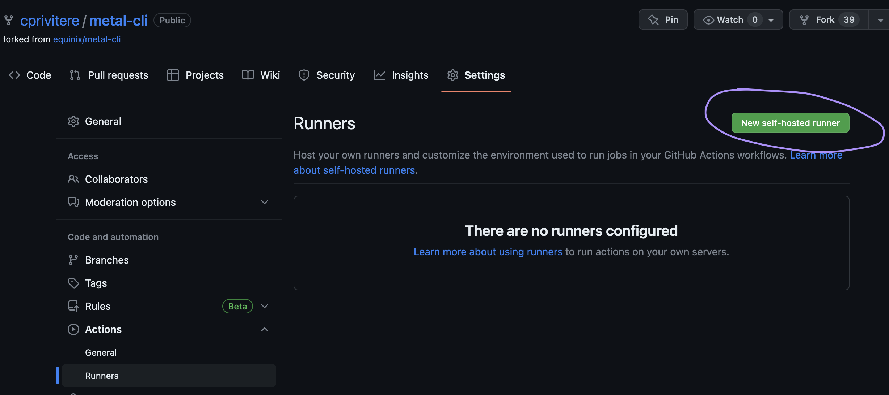
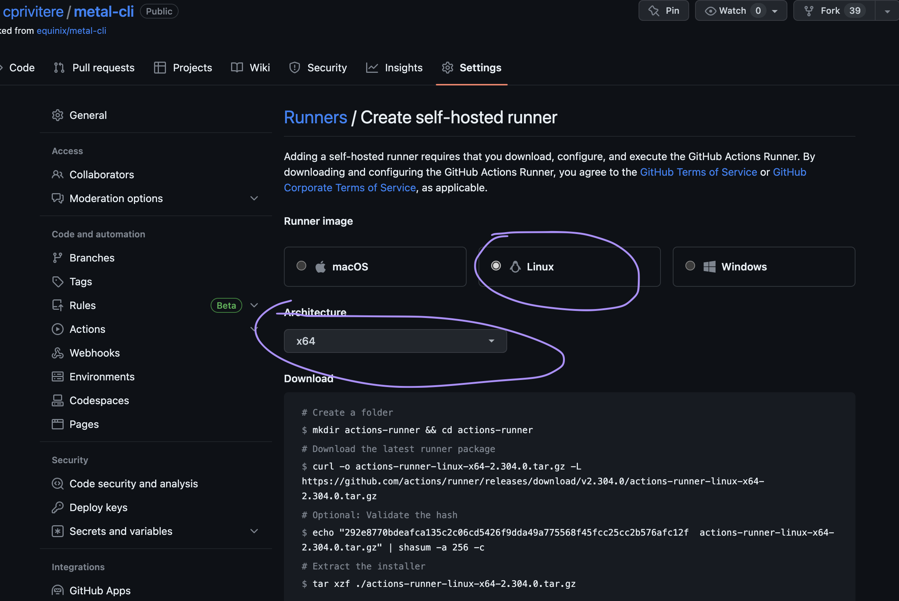

<!-- See https://squidfunk.github.io/mkdocs-material/reference/ -->
# Part 3: Create a runner on the Github Actions page

## Steps

### 1. Navigate to your metal-cli fork

For me it's [https://github.com/cprivitere/metal-cli](https://github.com/cprivitere/metal-cli)

### 2. Go to the 'settings' tab

Click on the Settings tab and you should see a view like this:



### 3. On the left bar, click 'actions', then 'runners'



### 4. Click the 'new self-hosted runner' button



### 5. Select the correct OS options, for our demo it's Linux x64



### 6. You should now see instructions for downloading, configuring, and using the github runner software


### 7. Run the commands to download and configure the runner

- SSH to the machine you created earlier.
- Install gcc, create a new user, and switch to it, the Github runner won't allow itself to be run as root.

  ```sh 
  apt update
  apt install build-essential gcc
  useradd -m ghrunner -s /bin/bash
  su - ghrunner
  ```

- Copy and paste the download and configure sections from the 'Add New Runner' page in step 6 above.
  - Take the defaults by just pressing enter when it asks for the group, name, labels, and work folder
  - Don't forget to run ./run.sh
  - If you were doing this as a long lived runner in production this would be better executed as a systemctl service...but long lived runners are actually not recommended, so just running ./run.sh inline is fine for today.

### 8. Your runner should now say it's 'Listening for Jobs'

## Discussion

Before proceeding to the next part let's take a few minutes to discuss what we did. Here are some questions to start the discussion.

- Can you have more than one self-hosted runner?
- What sorts of pre-requisites would your code repositories need on your own runners?
- How should I secure my runners?