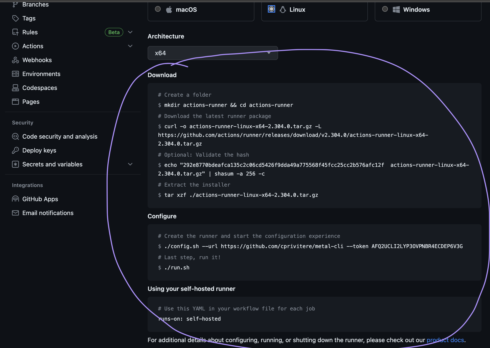
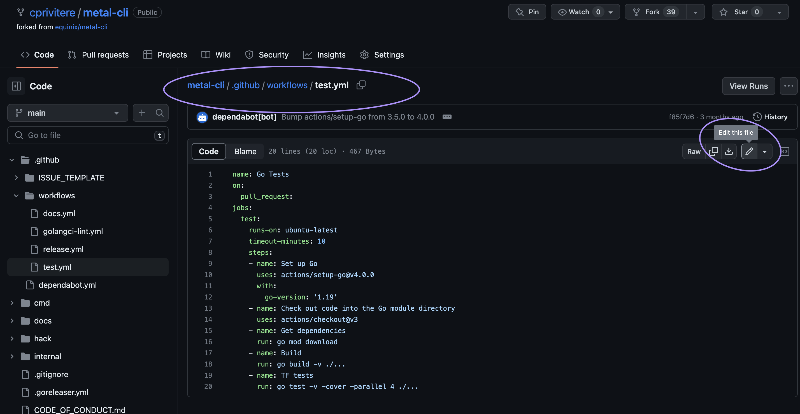
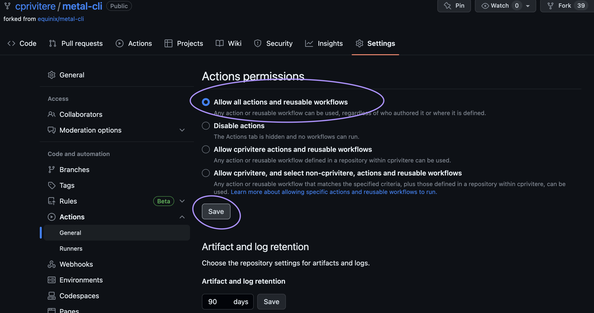
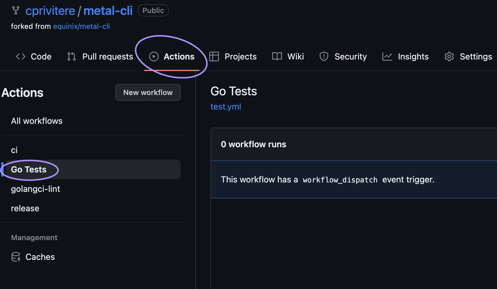
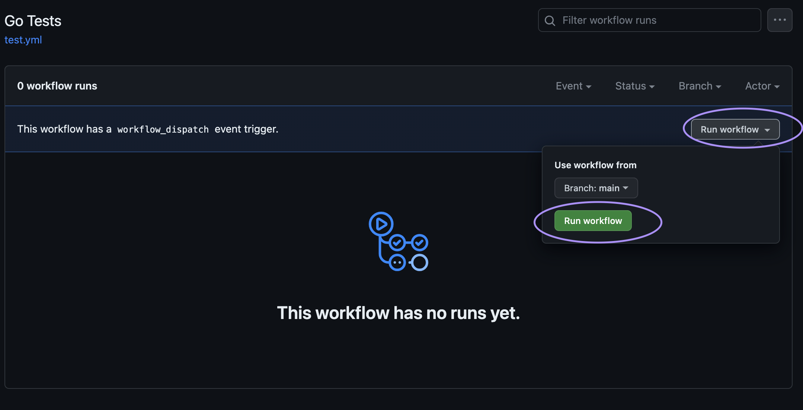

<!-- See https://squidfunk.github.io/mkdocs-material/reference/ -->
# Part 3: Execute a Github Action on your Runner

Now that we've got our GitHub Self-Hosted Runner set up let's test it out by running some tests with GitHub Actions!

## Steps

### 1. Configure our forked `metal-cli` repo to use the new Self-Hosted Runner

Let's go back to our fork of metal-cli. For me it's [https://github.com/cprivitere/metal-cli](https://github.com/cprivitere/metal-cli).

Navigate to the Runner settings again by going to **Settings** > **Actions** > **Runners**. You should see your new self-hosted runner listed.



Now we must edit our Github Actions workflow to use the new self-hosted runner. To do that, navigate to the file:

```
metal-cli/.github/workflows/test.yml
```



Edit the `test.yml` file with the following changes.

* Replace:

  ```yaml
      runs-on: ubuntu-latest
  ```

  with

  ```yaml
      runs-on: self-hosted
  ```

* Underneath the `on:` line, add:

  ```yaml
    workflow_dispatch:
  ```

Your `test.yml` file should now look like:

  ```yaml
  name: Go Tests
  on:
    pull_request:
    workflow_dispatch:
  jobs:
    test:
      runs-on: self-hosted
      timeout-minutes: 10
      steps:
      - name: Set up Go
        uses: actions/setup-go@v4.0.0
        with:
          go-version: '1.19'
      - name: Check out code into the Go module directory
        uses: actions/checkout@v3
      - name: Get dependencies
        run: go mod download
      - name: Build
        run: go build -v ./...
      - name: TF tests
        run: go test -v -cover -parallel 4 ./...
  ```

You can now commit your changes.

### 2. Ensure your GitHub Actions are being run on your Self-Hosted Runner

Go back to **Settings** > **Actions** > **General** and click on **Allow all actions and reusable workflows**. Save the changes.



Next, click on **Actions** and click on **Go Tests**' on the left side.



Click the **Run workflow** drop down on the right side and run it for the main branch.



Now watch the output on your GitHub Runner and the output inside GitHub. The following should appear:

```
Running job: test
```

## Discussion

Before proceeding to the next part let's take a few minutes to discuss what we did. Here are some questions to start the discussion.

* Can I use a mix of self-hosted and github-hosted runners within a workflow?
* What sort of logging do I get from my self-hosted runner?
* Can I see the results of my self-hosted runner on Github?
